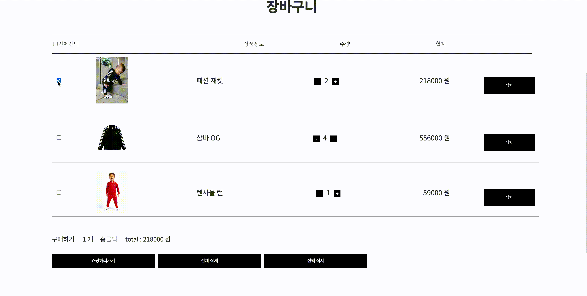
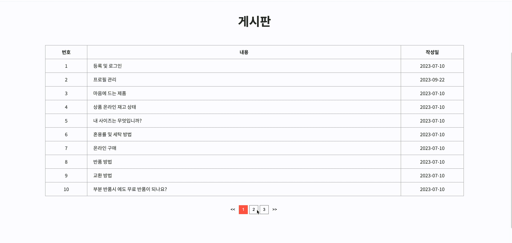
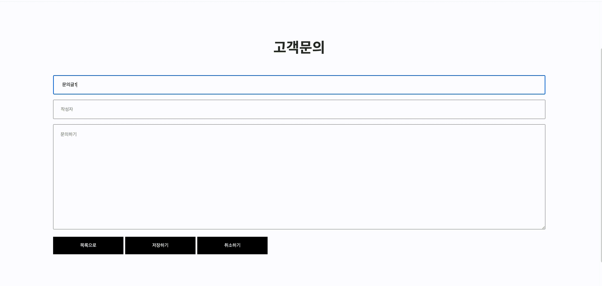
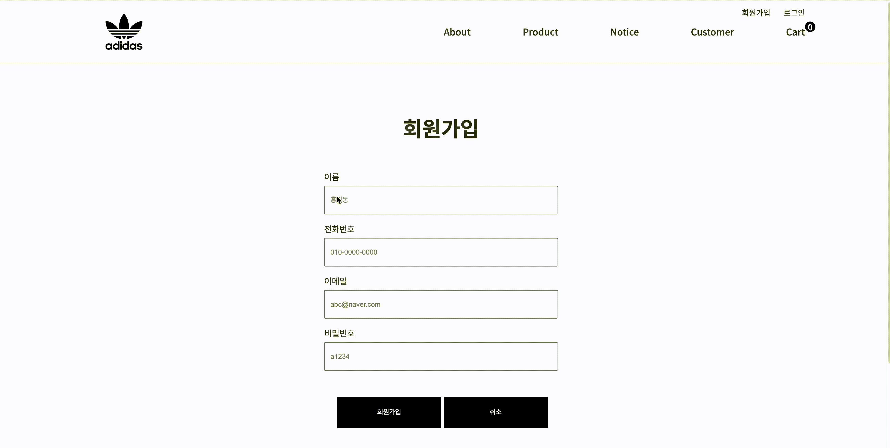

# AdidasMall Project README (English / Japanese)

## 👟 AdidasMall

| English (ENG) | Japanese (JP) | 
| :--- | :--- | 
| This is a shopping mall selling Adidas products. | Adidas製品を販売するショッピングモールです。 | 

Demo Link: <https://octdoki.github.io/Adidas/dist/>

---

## ✨ Project Goal / プロジェクト目的

| English (ENG) | Japanese (JP) | 
| :--- | :--- | 
| **Project Goal:** To acquire modern front-end development skills and implement an enterprise-level state management system (Redux Toolkit) by building a fully functional e-commerce mall. This project served as a foundation for mastering component-based architecture and advanced state control. | **プロジェクト目的:** 最新のフロントエンド開発スキルを習得し、完全な機能を持つECモールを構築することで、企業レベルのステート管理システム（Redux Toolkit）の実装能力を確立すること。コンポーネントベースのアーキテクチャと高度な状態制御の習得を目的としました。 | 

---

## 💻 Description / 概要

### Directory Structure / ディレクトリ構造
                  
                    📦src
                    ┣ 📂assets
                    ┣ 📂hooks
                    ┃ ┣ 📜useAxios.jsx
                    ┃ ┣ 📜useInput.jsx
                    ┃ ┗ 📜설명.txt
                    ┣ 📂pages
                    ┃ ┣ 📂about
                    ┃ ┃ ┣ 📜About.jsx
                    ┃ ┃ ┗ 📜AboutStyle.js
                    ┃ ┣ 📂cart
                    ┃ ┃ ┣ 📜Cart.css
                    ┃ ┃ ┣ 📜Cart.jsx
                    ┃ ┃ ┗ 📜ProjectStyle.js
                    ┃ ┣ 📂customer
                    ┃ ┃ ┣ 📜Customer.jsx
                    ┃ ┃ ┗ 📜CustomerStyle.js
                    ┃ ┣ 📂login
                    ┃ ┃ ┣ 📜Join.jsx
                    ┃ ┃ ┣ 📜Login.jsx
                    ┃ ┃ ┣ 📜LoginStyle.js
                    ┃ ┃ ┗ 📜Logout.jsx
                    ┃ ┣ 📂main
                    ┃ ┃ ┣ 📜Main.jsx
                    ┃ ┃ ┗ 📜MainStyle.js
                    ┃ ┣ 📂notfile
                    ┃ ┃ ┣ 📜NotfileStyle.js
                    ┃ ┃ ┗ 📜Notfiles.jsx
                    ┃ ┣ 📂notice
                    ┃ ┃ ┣ 📜Notice.jsx
                    ┃ ┃ ┗ 📜NoticeStyle.js
                    ┃ ┗ 📂product
                    ┃ ┃ ┣ 📜Product.jsx
                    ┃ ┃ ┣ 📜ProductSearch.jsx
                    ┃ ┃ ┗ 📜ProjectStyle.js
                    ┣ 📂store
                    ┃ ┣ 📂modules
                    ┃ ┃ ┣ 📜authSlice.jsx
                    ┃ ┃ ┣ 📜cartSlice.jsx
                    ┃ ┃ ┣ 📜customerSlice.jsx
                    ┃ ┃ ┣ 📜noticeSlice.jsx
                    ┃ ┃ ┗ 📜paginationSlice.jsx
                    ┃ ┗ 📜index.jsx
                    ┣ 📂styled
                    ┃ ┣ 📜GlobalStyle.js
                    ┃ ┣ 📜Style.js  
                    ┃ ┗ 📜swiperStyle.js
                    ┣ 📜.DS_Store
                    ┣ 📜App.jsx
                    ┣ 📜index.css
                    ┗ 📜main.jsx

  #### Enviorment / 環境

* 1. Git

* 2. NodeJS / Yarn

#### Technologies / 使用技術

* react

* react-dom

* react-router-dom

* redux-toolkit

---

## 🛠️ Key Features / 主要機能

### 1) Main / メイン

| English (ENG) | Japanese (JP) | 
| :--- | :--- | 
| Swiper slide banner | Swiperスライドバナー | 
| Refreshed Content | リニューアルコンテンツ | 

### 2) Brand Introduction / ブランド紹介

| English (ENG) | Japanese (JP) | 
| :--- | :--- | 
| Refreshed Content | リニューアルコンテンツ | 

### 3) Product List / 商品リスト

| English (ENG) | Japanese (JP) | 
| :--- | :--- | 
| Product Sorting | 商品の並べ替え機能 | 
| Reset Product Sorting | 商品ソートの初期化 | 
| Product List Search Function | 商品リストの検索機能 | 
| Add to Cart upon Clicking 'Order' | 「注文する」クリックでカートに追加 | 

### 4) Cart / カート

| English (ENG) | Japanese (JP) | 
| :--- | :--- | 
| Calculate Price based on Quantity Increase/Decrease | 商品の数量増減と、それに応じた価格計算 | 
| Deselecting 'Select All' when individual checkboxes are clicked (Planned) | 個別チェック時、全体チェックを解除 (予定) | 
| Update quantity and total upon checkbox click (Planned) | チェックボックスクリックで数量・合計を更新 (予定) | 
| Delete Selected Items | 選択商品の削除 | 
| Clear the Entire Shopping Cart | カートの全クリア | 
| Navigate to Product List upon Clicking 'Go Shopping' | 「買い物へ行く」ボタンクリックで商品リストへ移動 | 

### 5) Notice Board / お知らせ掲示板

| English (ENG) | Japanese (JP) | 
| :--- | :--- | 
| Pagination | ページネーション | 
| View Post Details and Navigate Back to the List | 投稿詳細の確認、リストへの戻り機能 | 

### 6) Customer Board / お問い合わせ掲示板

| English (ENG) | Japanese (JP) | 
| :--- | :--- | 
| Write Post Function | 投稿作成機能 | 
| Edit Post Function | 投稿修正機能 | 
| Delete Post Function | 投稿削除機能 | 
| Pagination | ページネーション | 
| Go to List | リストへ移動 | 
| Cancel Post Writing | 投稿作成キャンセル | 

### 7) Registration / Login / Logout (会員登録 / ログイン / ログアウト)

| English (ENG) | Japanese (JP) | 
| :--- | :--- | 
| Login Enabled upon Successful Registration | 会員登録後のログイン機能 | 
| Local Storage Integration (Planned) | ローカルストレージ連携 (予定) | 

